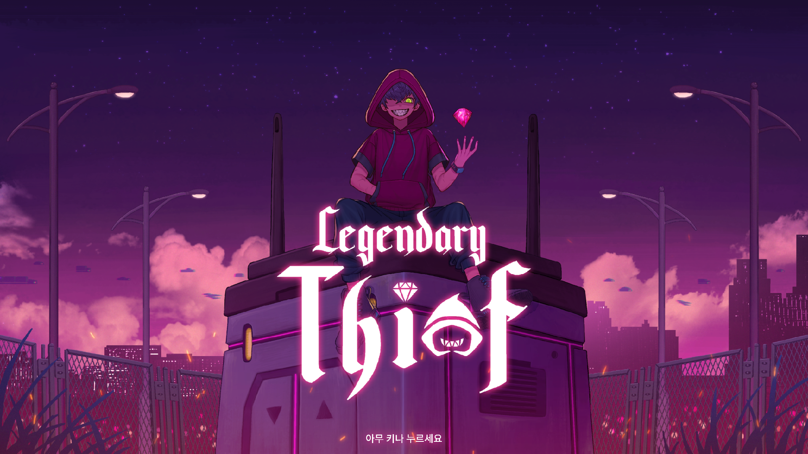
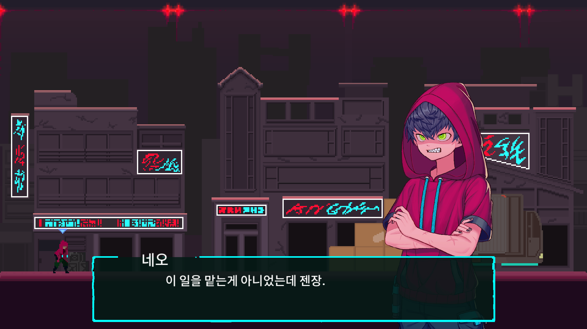
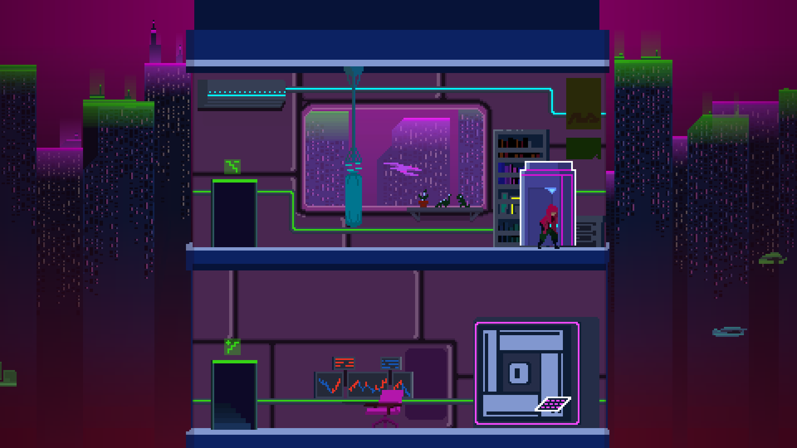
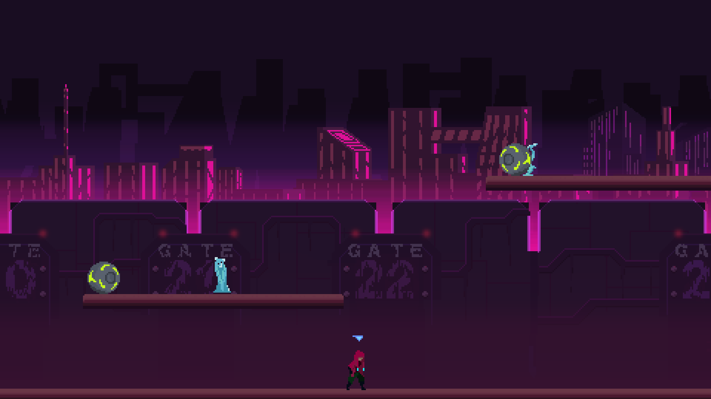
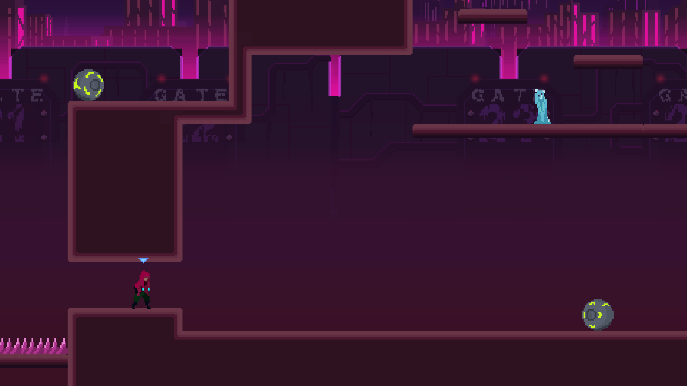

# Legendary Thief  Prototype1
 이 프로젝트는 인디게임팀 **PixelSilo**에서 개발하던 프로젝트의 프로토타입 1번입니다.
 팀의 1인 프로그래머로 Unity엔진을 사용해 개발하였습니다.
 
 ----
### 어떤 게임인가

   게임명 : LegendaryThief
   타겟 플랫폼 : Android (미출시)
   사용언어, 엔진 : C#, Unity
   
</img></img>
</img></img>
</img>

게임 플레이 영상 : https://youtu.be/CS2kAQpRNsA

**게임 소개**
> 전 세계에 퍼져있는 유물을 훔쳐 전설의 대도둑이 되는 스토리를 가지고 있습니다.     
> 2D 플랫포머 게임으로 경비로봇(적)을 공격해 처리하는게 아닌 몰래 잠입하여 물건을 훔쳐가며 진행합니다.

----
### 사용한 유니티 기능
 * **애니메이션**
   * **Sprite Sheet**를 이용한 애니메이션 구현.
   * **Animation Controller**의 Transition 및 애니메이션 이벤트를 이용한 코드 구현.
 * **URP(Universal Render Pipeline)**
   * 튜토리얼(대화 부분)의 Bloom 효과를 위해 사용.
   * 그래픽 디자이너가 넘겨준 Shader(포탈 사용시의 이펙트) 적용.
 * **PixelPerfectCamera**
   * 유니티 Package Manager의 **2D Pixel Perfect** 사용.
 * **Tilemap**
   * 맵 디자인에 Tilemap, TilemapCollider 사용.
 * **Unity Collaborate**
   * 기획자가 직접 맵을 수정하며 테스트를 하기위해 **Unity Collaborate**를 사용하여 협업 진행.
   * 그래픽 디자이너가 Shader의 세부 설정을 수정하기 위하여 **Unity Collaborate**를 사용하여 협업 진행.
